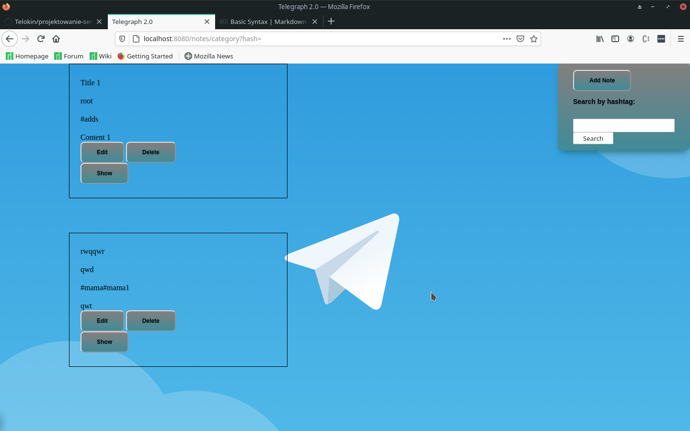
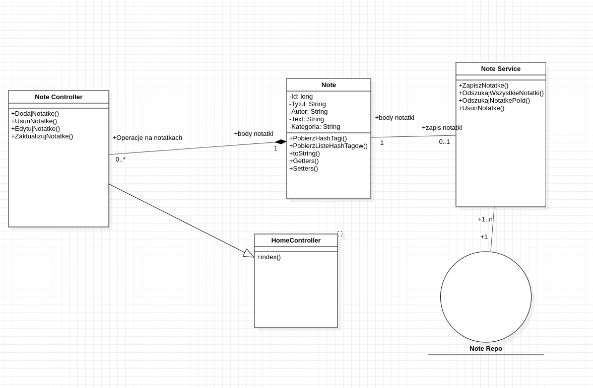

# Opis aplikacji
Notatnik internetowy. Aplikacja sluzy do prostych operacji w notatniku.
# Edytor tekstu
Dzieki skorzystaniu z napisanego
w JavaScript edytora tekstu mozliwe jest dodawanie w notatkach rowniez obrazow,
odnosnikow do stron itd.. (Edytor zostal pobrany z internetu)
# Mozliwosci notatnika
Aplikacja ma mozliwosc grupowania i wyszukiwania notatek po HashTagu co pozwala
na latwy dostep do interesujacych nas notatek. 
Poza tym notatnik ma mozliwosc generowania html ktory pozwala
przesylac sobie notatki bez potrzeby przeszukiwania calej reszty.
# Minusy aplikacji
Notatnik nie ma ustawionych kont uzytkownikow przez co jest latwo dostepny
ale rowniez latwy do zepsucia poniewaz, kazdy ma taki sam dostep do notatek
i moze je edytowac i usowac.
# Wizualizacja strony
Dzieki wykorzystaniu bootstrapa strona wyglada estetycznie i jest latwa w
obsludze przez zachowanie czytelnosci samej strony.

Przy laczeniu front-endu z back-endem strony wykorzystany zostal
Thymeleaf, ktory zapewnil wzgledna prostote polaczen 
# Diagram klas dla programu
